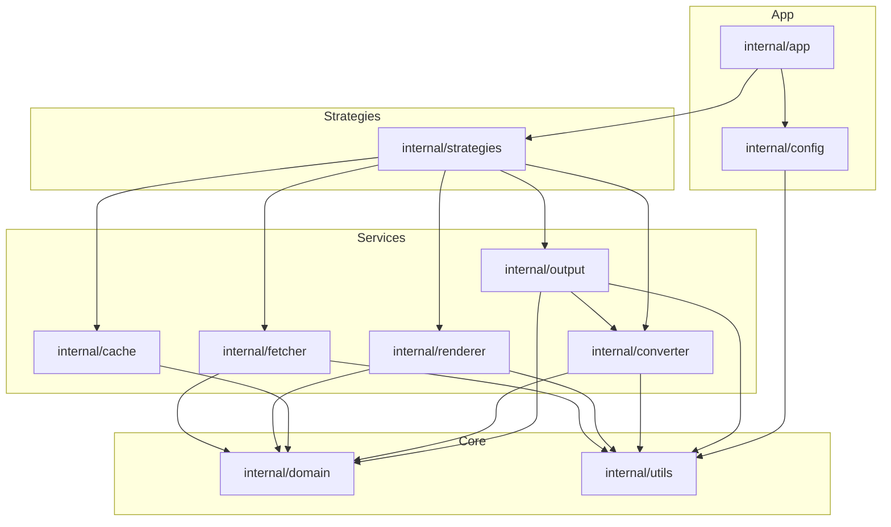

# Dependency Analysis

## Internal Dependencies

The application follows a hierarchical dependency structure where the orchestrator layer coordinates specialized service layers.

*   **`internal/app`**: The top-level entry point. It depends on `internal/strategies` for documentation extraction logic, `internal/config` for application settings, and `internal/utils` for logging and common helpers.
*   **`internal/strategies`**: Contains the core business logic. It depends on all service modules: `internal/fetcher`, `internal/renderer`, `internal/converter`, `internal/cache`, `internal/output`, and `internal/domain`. All strategy implementations (`crawler`, `git`, `llms`, `pkggo`, `sitemap`) reside here.
*   **`internal/fetcher`**: Specialized HTTP client layer. Depends on `internal/domain` for request/response models and `internal/utils`.
*   **`internal/renderer`**: Headless browser automation layer. Depends on `internal/domain` for interfaces and `internal/utils`.
*   **`internal/converter`**: Transformation layer (HTML to Markdown). Depends on `internal/domain` and `internal/utils`.
*   **`internal/output`**: Filesystem operations layer. Depends on `internal/converter` (for frontmatter processing), `internal/domain`, and `internal/utils`.
*   **`internal/cache`**: Storage layer. Depends on `internal/domain` for interfaces.
*   **`internal/domain`**: The "leaf" node containing core interfaces and data models (`Document`, `Response`). It has no internal dependencies.
*   **`internal/utils`**: Cross-cutting utilities (logging, URL parsing, FS helpers). It has no internal dependencies.

## External Dependencies

The project relies on several specialized libraries for its core functionality:

*   **Stealth Networking**: `github.com/bogdanfinn/tls-client` and `fhttp` are used to bypass bot detection during fetching.
*   **Web Scraping & Rendering**: `github.com/gocolly/colly/v2` for web crawling and `github.com/go-rod/rod` with `stealth` for JavaScript rendering.
*   **Content Extraction**: `github.com/go-shiori/go-readability` for identifying main content and `github.com/JohannesKaufmann/html-to-markdown/v2` for conversion.
*   **Storage**: `github.com/dgraph-io/badger/v4` provides the persistent KV store for caching.
*   **SCM**: `github.com/go-git/go-git/v5` manages Git repository operations.
*   **CLI & Configuration**: `github.com/spf13/cobra` handles the command-line interface, while `github.com/spf13/viper` manages configuration.
*   **Logging**: `github.com/rs/zerolog` provides structured logging.

## Dependency Graph

## Dependency Injection

The project uses manual Dependency Injection (DI) to manage its components:

*   **Dependency Container**: The `strategies.Dependencies` struct acts as a service container, holding instances of `Fetcher`, `Renderer`, `Cache`, `Converter`, and `Writer`.
*   **Constructor Injection**: Strategies are initialized via constructors (e.g., `NewCrawlerStrategy(deps *Dependencies)`) that receive the shared dependencies.
*   **Interface-based Decoupling**: Core components like the `Cache` and `Renderer` are referenced via interfaces defined in `internal/domain`, allowing implementations (like Badger or Rod) to be swapped or mocked.
*   **Factory Pattern**: The `app` package uses a `StrategyFactory` pattern to create the appropriate strategy for a given URL, allowing the `Orchestrator` to remain agnostic of specific strategy implementation details during testing.

## Potential Issues

*   **Strategy Factory Coupling**: The `internal/app` package is tightly coupled to every strategy implementation because it explicitly imports them to instantiate them in its factory methods.
*   **Inconsistent Interface Usage**: While `Renderer` and `Cache` are used as interfaces, `fetcher.Client`, `converter.Pipeline`, and `output.Writer` are often used as concrete types in the `Dependencies` struct, which may complicate mocking in certain test scenarios.
*   **Circular Dependency Risk**: The `internal/output` package depends on `internal/converter` to add frontmatter to documents. If the converter ever needs to reference the output writer (e.g., for asset management), a circular dependency would occur. Currently, the relationship is strictly one-way.