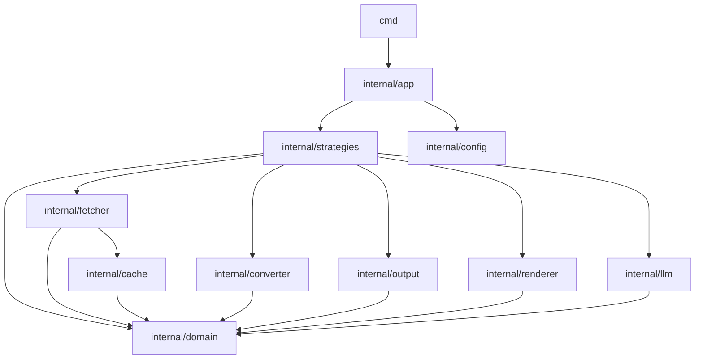

# Dependency Analysis

## Internal Dependencies

The application follows a modular architecture with a clear separation of concerns, primarily driven by a core `domain` package containing shared interfaces and models.

*   **`cmd`**: The entry point for the CLI, responsible for parsing flags and initializing the orchestrator.
*   **`internal/app`**: Contains the `Orchestrator` which manages the high-level workflow. It uses the `Detector` to select an appropriate strategy for a given URL and coordinates the execution.
*   **`internal/strategies`**: Implements various data extraction methods (Crawler, Git, Sitemap, LLMS.txt, Wiki, PkgGo). All strategies implement the `domain.Strategy` interface and depend on a shared `Dependencies` container.
*   **`internal/domain`**: The "leaf" package containing all core interfaces (`Fetcher`, `Renderer`, `Cache`, `Converter`, `Writer`, `LLMProvider`) and data models (`Document`, `Response`). Most other packages depend on this for abstractions.
*   **`internal/fetcher`**: Implements the `Fetcher` interface using `tls-client` for stealth HTTP requests. It integrates with `internal/cache` for persistent response caching.
*   **`internal/renderer`**: Implements the `Renderer` interface using `go-rod` for JavaScript-heavy pages.
*   **`internal/converter`**: Provides a pipeline for transforming HTML into Markdown, utilizing `go-readability` and `html-to-markdown`.
*   **`internal/output`**: Handles file system persistence and metadata collection.
*   **`internal/llm`**: Provides integration with external LLM providers (OpenAI, Anthropic, Google) for document metadata enhancement.
*   **`internal/cache`**: Implements a Badger-based key-value store for the `Cache` interface.
*   **`internal/utils`**: Contains cross-cutting utilities like logging, URL parsing, and file system helpers.

## External Dependencies

The project leverages several specialized libraries to handle complex tasks:

*   **HTTP & Stealth**:
    *   `github.com/bogdanfinn/tls-client`: Used to bypass bot detection by mimicking browser TLS fingerprints.
    *   `github.com/bogdanfinn/fhttp`: Required by `tls-client` for HTTP/2 support.
    *   `github.com/go-rod/rod` & `github.com/go-rod/stealth`: Headless browser automation for rendering JavaScript.
*   **Scraping & Extraction**:
    *   `github.com/gocolly/colly/v2`: High-level crawling framework.
    *   `github.com/PuerkitoBio/goquery`: jQuery-like HTML selection and manipulation.
    *   `github.com/go-shiori/go-readability`: Port of Mozilla's readability for main content extraction.
*   **Content Conversion**:
    *   `github.com/JohannesKaufmann/html-to-markdown/v2`: Core engine for Markdown generation.
*   **Git Operations**:
    *   `github.com/go-git/go-git/v5`: Pure Go implementation for cloning and reading Git repositories without external dependencies.
*   **Persistence**:
    *   `github.com/dgraph-io/badger/v4`: High-performance embedded key-value store for caching.
*   **Frameworks & Infrastructure**:
    *   `github.com/spf13/cobra` & `github.com/spf13/viper`: Standard Go CLI and configuration management.
    *   `github.com/rs/zerolog`: Structured logging.
    *   `github.com/cenkalti/backoff/v4`: Robust retry logic for network operations.

## Dependency Graph

## Dependency Injection

The project uses **Manual Dependency Injection** via a central container:

1.  **Interface Abstraction**: All major components (Fetcher, Renderer, Cache, etc.) are defined as interfaces in `internal/domain`.
2.  **The Dependencies Struct**: A `strategies.Dependencies` struct in `internal/strategies` acts as a service locator/container that holds concrete implementations of all required interfaces.
3.  **Initialization**: The `Orchestrator` initializes these dependencies based on configuration in `NewOrchestrator` and passes the container down to the strategies.
4.  **Mocking**: For testing, interfaces allow the injection of mocks (generated via `go.uber.org/mock`) to isolate units during execution.

## Potential Issues

*   **God Object Pattern**: The `strategies.Dependencies` struct is a large shared container. While it facilitates passing dependencies to strategies, it creates a focal point that changes whenever any sub-service initialization logic changes.
*   **Tight Coupling in Strategies**: Strategies are directly coupled to the `Dependencies` struct rather than receiving only the specific interfaces they need. However, since strategies often need multiple services (fetcher, cache, converter), this is a pragmatic trade-off.
*   **Version Pinning**: Some dependencies (like `go-readability`) are pinned to specific git commits rather than semantic versions, which can lead to stability issues if the upstream changes or disappears.
*   **Resource Management**: Multiple components (Badger, Rod, LLM providers) require explicit `Close()` calls. The orchestrator manages this, but deep nesting of these components makes resource leak prevention more complex.