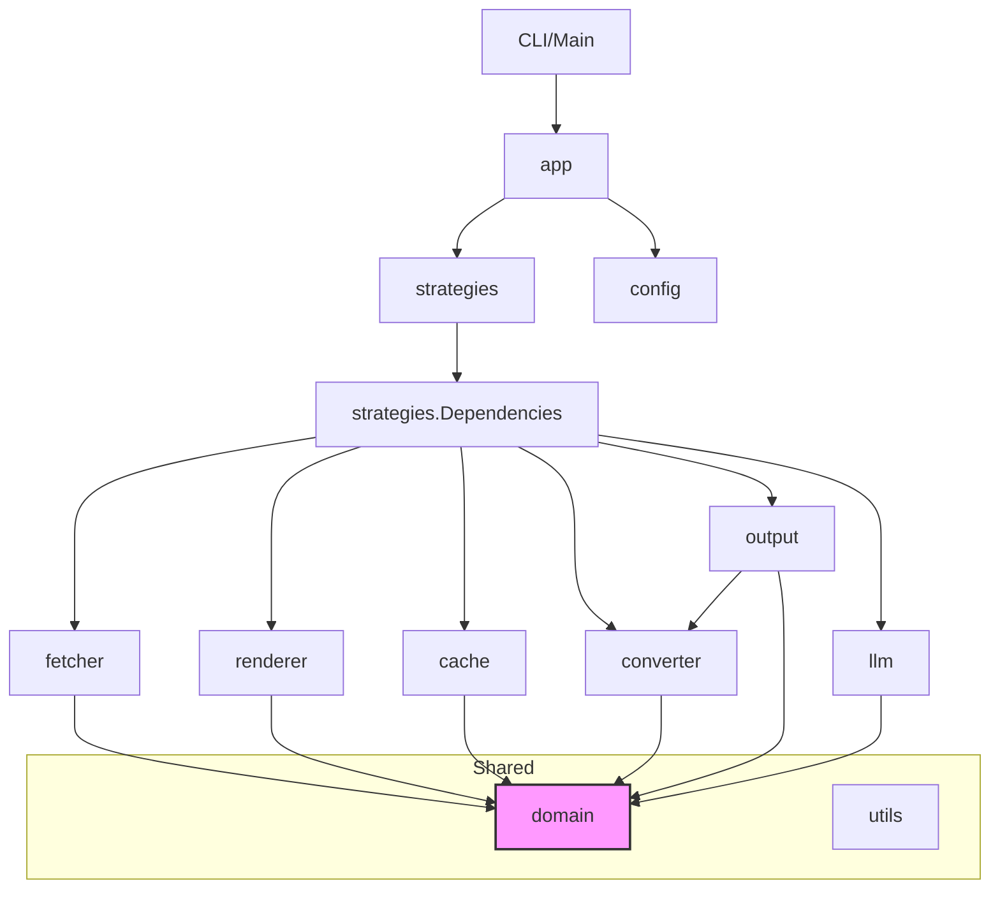

# Dependency Analysis

## Internal Dependencies

The application follows a modular architecture where components are decoupled through interfaces defined in a core domain layer.

- **`domain`**: The foundation of the system. It defines all core models (`Document`, `Page`, `Response`) and primary interfaces (`Fetcher`, `Renderer`, `Cache`, `Converter`, `Writer`, `LLMProvider`, `Strategy`). It has zero internal dependencies, serving as the leaf node of the dependency graph.
- **`utils`**: Provides shared utility functions for URL manipulation, file system operations, logging (`zerolog` wrapper), and concurrency management (`workerpool`).
- **`config`**: Manages application settings using `viper`. It is consumed by most initialization logic but depends only on the standard library and `viper`.
- **`cache`**: Implements the `domain.Cache` interface using the Badger K/V store.
- **`fetcher`**: Implements the `domain.Fetcher` interface. It provides robust HTTP capabilities, including stealth (impersonating browsers) and retry logic. It optionally depends on `domain.Cache`.
- **`renderer`**: Implements the `domain.Renderer` interface using the Rod browser automation library to handle JavaScript-heavy documentation.
- **`converter`**: A pipeline-based module that transforms HTML to Markdown. It depends on `domain` for models and `utils` for processing.
- **`output`**: Handles persistence of converted documents to disk and collection of metadata for index generation. It depends on `domain`, `converter` (for frontmatter injection), and `utils`.
- **`llm`**: Implements the `domain.LLMProvider` interface for multiple backends (OpenAI, Anthropic, Google) using raw HTTP clients. It also provides a `MetadataEnhancer` that uses LLMs to enrich `domain.Document` objects.
- **`strategies`**: The core business logic layer. It implements various documentation gathering strategies (Crawler, Git, Sitemap, Wiki, LLMS.txt, PkgGo). This package acts as the primary consumer of all other internal modules through a centralized `Dependencies` struct.
- **`app`**: The top-level orchestration layer. It handles strategy detection and coordinates the execution of strategies based on user input.

## External Dependencies

The project leverages several high-quality external libraries for specialized tasks:

- **Storage & Caching**: `github.com/dgraph-io/badger/v4` (Persistent K/V store).
- **Web & Scraping**: 
    - `github.com/gocolly/colly/v2`: Asynchronous web crawling.
    - `github.com/go-rod/rod` & `github.com/go-rod/stealth`: Browser automation and bot detection evasion.
    - `github.com/bogdanfinn/tls-client`: Advanced TLS fingerprinting for stealth HTTP requests.
- **Git Operations**: `github.com/go-git/go-git/v5` (Pure Go implementation of Git).
- **Content Processing**:
    - `github.com/JohannesKaufmann/html-to-markdown/v2`: HTML to Markdown conversion.
    - `github.com/go-shiori/go-readability`: Main content extraction from HTML.
    - `github.com/PuerkitoBio/goquery`: HTML parsing and manipulation (jQuery-like).
- **CLI & Infrastructure**:
    - `github.com/spf13/cobra`: CLI framework.
    - `github.com/spf13/viper`: Configuration management.
    - `github.com/rs/zerolog`: Structured logging.
    - `github.com/cenkalti/backoff/v4`: Exponential backoff for retries.
- **UI**: `github.com/schollz/progressbar/v3` (Console progress bars).

## Dependency Graph

The application structure follows a directed acyclic graph (DAG) pattern:

## Dependency Injection

The project employs a structured dependency injection (DI) pattern to maintain testability and flexibility:

1.  **Interface-Driven**: All major services are defined as interfaces in the `domain` package. Implementations reside in their respective packages (`cache`, `fetcher`, `renderer`, etc.).
2.  **Aggregate Dependency Struct**: The `strategies.Dependencies` struct acts as a service locator/container that holds implementations for all core services required by extraction strategies.
3.  **Constructor Injection**: Services and strategies receive their dependencies through constructors (e.g., `NewCrawlerStrategy(deps *Dependencies)`).
4.  **Strategy Factory**: The `app` package uses a factory pattern (`CreateStrategy`) to instantiate the correct strategy implementation based on the detected URL type, injecting the shared `Dependencies` container into each.
5.  **Mocking Support**: The use of interfaces throughout the system facilitates the use of `go.uber.org/mock` for unit and integration testing.

## Potential Issues

- **Coupling in `strategies`**: The `strategies` package depends on almost every other internal package. While this is expected for an orchestrating layer, it makes the package highly sensitive to changes across the codebase.
- **Output-Converter Link**: The `output` package depends on the `converter` package specifically to add YAML frontmatter to files. This creates a circular-adjacent relationship where the converter creates the content, but the output module knows how to further "convert" it by adding headers.
- **Stealth Dependencies**: The project relies on specialized networking libraries (`tls-client`, `fhttp`). While providing excellent capability, these increase the complexity of the HTTP stack and could lead to maintenance challenges if the underlying TLS landscape changes rapidly.
- **Large Domain Models**: The `domain.Document` model is quite large, carrying both raw data and AI-enhanced metadata. As the system grows, splitting this into separate "Raw" and "Enriched" models might be necessary to avoid passing unnecessary data between early pipeline stages.