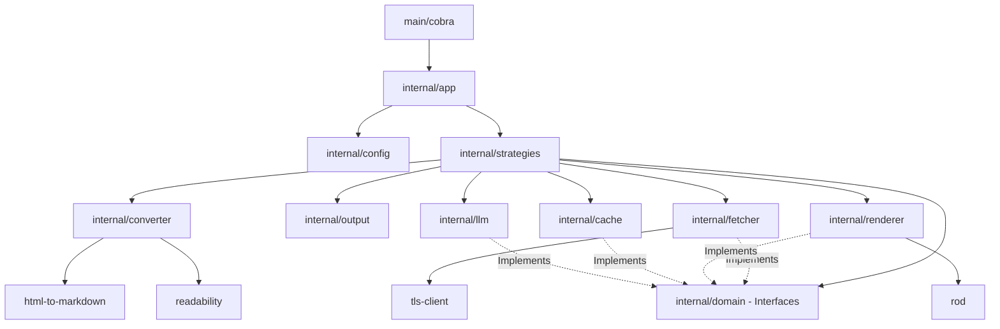

# Dependency Analysis

## Internal Dependencies

The application follows a layered architecture with a central `domain` package defining interfaces used for dependency injection.

*   **`internal/app` (Orchestration):** Coordinates the execution. It depends on `config` for settings, `strategies` for execution logic, and `utils` for logging and shared helpers.
*   **`internal/strategies` (Strategy Pattern):** Implements different data acquisition methods (Crawler, Git, Sitemap, LLMs, Wiki). It acts as a consumer of almost all other internal services.
*   **`internal/domain` (Core Interfaces):** Defines the contracts (`Fetcher`, `Renderer`, `Cache`, `LLMProvider`) that allow the system to remain decoupled from specific implementations.
*   **`internal/fetcher` & `internal/renderer`:** Provide HTTP and browser-based data acquisition. Both implement interfaces from the `domain` package.
*   **`internal/converter`:** Handles the transformation of HTML to Markdown. It is a standalone pipeline used by strategies to process raw content.
*   **`internal/output`:** Manages file writing and metadata collection. It is the final sink for processed documents.
*   **`internal/cache`:** Provides persistence (BadgerDB) for fetched content, used primarily by the `fetcher` and `strategies`.
*   **`internal/llm`:** Provides AI-powered metadata enhancement, implementing `LLMProvider` for OpenAI, Anthropic, and Google.
*   **`internal/utils`:** Shared utility functions (logging, URL parsing, file system operations, worker pools) used across the entire codebase.

## External Dependencies

The project leverages several high-quality Go libraries for its specialized tasks:

*   **Data Acquisition:**
    *   `github.com/gocolly/colly/v2`: Primary engine for web crawling.
    *   `github.com/go-rod/rod`: DevTools protocol driver for JavaScript rendering.
    *   `github.com/go-git/go-git/v5`: Pure Go implementation of Git for repository cloning.
    *   `github.com/bogdanfinn/tls-client`: Used for advanced HTTP/TLS fingerprinting to avoid bot detection.
*   **Content Processing:**
    *   `github.com/JohannesKaufmann/html-to-markdown/v2`: Core HTML to Markdown conversion.
    *   `github.com/PuerkitoBio/goquery`: jQuery-like DOM manipulation for HTML extraction.
    *   `github.com/go-shiori/go-readability`: Port of Mozilla's Readability for main content extraction.
*   **Infrastructure & CLI:**
    *   `github.com/spf13/cobra` & `github.com/spf13/viper`: CLI command structure and configuration management.
    *   `github.com/dgraph-io/badger/v4`: High-performance embedded K/V store for caching.
    *   `github.com/rs/zerolog`: Structured logging.
*   **Utilities:**
    *   `github.com/cenkalti/backoff/v4`: Exponential backoff for retries.
    *   `github.com/schollz/progressbar/v3`: Terminal progress bars.

## Dependency Graph

## Dependency Injection

The project heavily utilizes **Constructor Injection** combined with **Interface-based Decoupling**:

1.  **Dependency Container:** The `strategies.Dependencies` struct acts as a service locator/container that is initialized once and passed to individual strategies.
2.  **Interface Satisfaction:** Implementation packages (like `fetcher`, `renderer`, `cache`, and `llm`) are kept separate from the `domain` package. The `strategies.NewDependencies` function wires the concrete implementations (e.g., `NewBadgerCache`) to the `domain.Cache` interface.
3.  **Strategy Factory:** The `Orchestrator` uses a `StrategyFactory` function that can be overridden in tests, allowing for the injection of mock strategies.
4.  **Composition:** The `fetcher` is injected into the `colly` collector (via a custom transport), showing how internal dependencies are bridged to external libraries.

## Potential Issues

*   **The `Dependencies` Struct:** While convenient, the `strategies.Dependencies` struct is starting to resemble a "God Object" or "Service Locator" pattern. Almost every strategy receives the full set of dependencies even if they only need a subset (e.g., `GitStrategy` likely doesn't need the `Renderer`).
*   **Deeply Nested Tests:** Many tests (in `tests/integration` and `tests/unit`) depend on the full `Orchestrator` or `Dependencies` setup, making them more complex to maintain and slower to run.
*   **Tight Coupling with BadgerDB:** While the `domain.Cache` interface exists, the `NewDependencies` function is hardcoded to instantiate `cache.NewBadgerCache`, making the infrastructure choice difficult to swap without modifying the `strategies` package.
*   **Circular Dependencies (Potential):** The relationship between `converter` and `domain` is clean (converter returns domain models), but the reliance of `strategies` on both `converter` and `output` requires careful management of package boundaries to avoid cycles if `converter` ever needs to know about `strategies`.