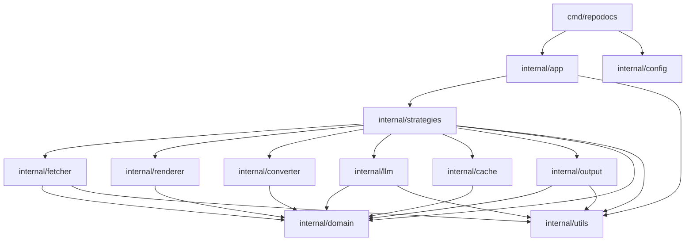

# Dependency Analysis

## Internal Dependencies

The application follows a modular architecture with a clear separation of concerns, anchored by a central `domain` layer.

*   **`cmd/repodocs`**: The entry point. It depends on `app` for orchestration, `config` for settings, and `utils` for logging and path handling.
*   **`internal/app`**: Contains the `Orchestrator` and `StrategyDetector`. It depends on `strategies` to create and execute extraction logic, and `config` to initialize the environment.
*   **`internal/strategies`**: The most dependency-heavy layer. It implements various extraction methods (Git, Crawler, Sitemap, etc.). It depends on almost all other internal modules via a shared `Dependencies` struct:
    *   `fetcher`: For HTTP requests.
    *   `renderer`: For JavaScript execution.
    *   `converter`: For HTML-to-Markdown processing.
    *   `cache`: For persistence.
    *   `output`: For file writing and metadata collection.
    *   `llm`: For AI-enhanced metadata.
*   **`internal/domain`**: The core package containing shared models (`Document`, `Page`, `Response`) and interfaces (`Fetcher`, `Renderer`, `Cache`, `LLMProvider`). Most other packages depend on this to maintain decoupling.
*   **`internal/utils`**: A utility layer providing shared logic for logging, URL manipulation, and file system operations.

## External Dependencies

The project leverages several specialized libraries for web scraping and document processing:

*   **Web & Networking**:
    *   `github.com/gocolly/colly/v2`: Primary crawling framework.
    *   `github.com/bogdanfinn/tls-client` & `fhttp`: HTTP client with TLS fingerprinting to bypass bot detection.
    *   `github.com/go-rod/rod` & `stealth`: Headless browser automation for rendering JavaScript-heavy sites.
*   **Content Processing**:
    *   `github.com/JohannesKaufmann/html-to-markdown/v2`: Core HTML to Markdown conversion engine.
    *   `github.com/go-shiori/go-readability`: Content extraction (distill/article mode).
    *   `github.com/PuerkitoBio/goquery`: jQuery-like HTML parsing and manipulation.
*   **Version Control**:
    *   `github.com/go-git/go-git/v5`: Pure Go implementation of Git for cloning repositories.
*   **Infrastructure & CLI**:
    *   `github.com/spf13/cobra` & `viper`: Command-line interface and configuration management.
    *   `github.com/dgraph-io/badger/v4`: High-performance embedded key-value store used for the persistent cache.
    *   `github.com/rs/zerolog`: Structured, high-performance logging.
    *   `github.com/schollz/progressbar/v3`: Interactive CLI progress bars.
*   **Utilities**:
    *   `github.com/cenkalti/backoff/v4`: Exponential backoff for retrying network operations.
    *   `github.com/klauspost/compress`: Optimized compression (used for sitemap handling).

## Dependency Graph

## Dependency Injection

The application uses **Constructor Injection** and a **Registry Pattern** to manage its complex dependency tree:

1.  **Dependency Container**: The `strategies.Dependencies` struct acts as a manually managed dependency container. It holds implementations of various interfaces (`Fetcher`, `Renderer`, `Cache`) and is passed to every strategy upon instantiation.
2.  **Interface Decoupling**: Implementations are defined in their respective packages (e.g., `internal/cache/badger.go`), but the `strategies` package interacts with them only through interfaces defined in `internal/domain/interfaces.go`.
3.  **Functional Options/Factories**: The `Orchestrator` allows injecting a `StrategyFactory` function, facilitating easier unit testing by allowing mocks to be substituted for actual extraction strategies.
4.  **Mocking**: The project uses `go.uber.org/mock` to generate mocks for all `domain` interfaces, ensuring that components can be tested in isolation despite the deep dependency tree.

## Potential Issues

*   **Large Dependency Struct (God Object)**: The `strategies.Dependencies` struct is quite large and is passed everywhere in the strategy layer. While it centralizes dependency management, it creates a "mega-object" that every strategy must handle, even if it only needs one or two of those dependencies.
*   **Interface Redundancy**: There is a slight duplication between `internal/domain.Strategy` and `internal/strategies.Strategy`. They use different `Options` structs, which suggests the abstraction is currently in flux or partially redundant.
*   **Tight Coupling with Utils**: Almost every package imports `internal/utils`. While common for logging, the inclusion of path manipulation and URL helpers in the same package makes it a frequent point of change.
*   **Strategy Implementation Leakage**: The `app` package's `Detector` explicitly knows about every strategy implementation through `CreateStrategy`. Adding a new strategy requires modifying the `app` package, violating the Open/Closed Principle.