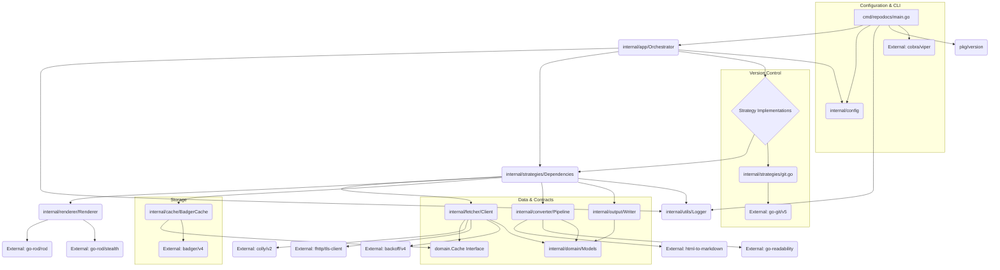

# Dependency Analysis
The `repodocs-go` project is structured around a core orchestration layer that manages various extraction strategies, each relying on a shared set of infrastructure components (fetcher, renderer, cache, converter). The dependency structure is highly modular, with a clear composition root responsible for wiring all components together.

## Internal Dependencies Map
The internal architecture follows a layered pattern, with dependencies flowing from the command entry point down to the core infrastructure components.

| Dependent Package | Dependencies (Internal) | Dependencies (External/Standard Library) | Role/Notes |
| :--- | :--- | :--- | :--- |
| `cmd/repodocs` | `internal/app`, `internal/config`, `internal/utils`, `pkg/version` | `cobra`, `viper`, `context`, `os`, `syscall` | Application entry point and configuration loading. Wires the `Orchestrator`. |
| `internal/app` (Orchestrator) | `internal/config`, `internal/strategies`, `internal/utils` | `context`, `time`, `fmt` | Coordinates the entire process. Factory for `strategies.Dependencies` and selects the appropriate `Strategy`. |
| `internal/strategies` | `internal/cache`, `internal/converter`, `internal/domain`, `internal/fetcher`, `internal/output`, `internal/renderer`, `internal/utils` | `time`, `fmt` | **Composition Root** for infrastructure components. Defines the `Dependencies` container used by all specific strategies (e.g., `crawler`, `git`). |
| `internal/fetcher` | `internal/cache`, `internal/domain` | `fhttp`, `tls-client`, `colly/v2`, `backoff/v4` | Handles HTTP requests, retries, and caching. Uses specialized clients for stealth. |
| `internal/renderer` | `internal/utils` | `rod`, `stealth` | Manages the headless browser (Chromium) for JavaScript rendering. |
| `internal/cache` | `internal/domain` | `badger/v4` | Provides a persistent key-value store implementation for caching. |
| `internal/converter` | `internal/domain` | `html-to-markdown/v2`, `go-readability`, `goquery` | Transforms raw HTML content into clean Markdown. |
| `internal/output` | `internal/domain`, `internal/utils` | `os`, `path/filepath` | Handles writing the final documentation files to disk. |
| `internal/domain` | (None) | (None) | Contains core models, interfaces (`Cache`, `Document`), and custom errors, acting as a central contract layer. |

## External Libraries Analysis
The project relies on a robust set of third-party Go libraries to handle complex tasks like web scraping, browser automation, and configuration.

| Library | Version | Purpose |
| :--- | :--- | :--- |
| `github.com/spf13/cobra` | v1.10.2 | Command-line interface framework. |
| `github.com/spf13/viper` | v1.21.0 | Configuration management, binding flags and config files. |
| `github.com/rs/zerolog` | v1.34.0 | Structured, leveled logging. |
| `github.com/dgraph-io/badger/v4` | v4.8.0 | Embedded key-value store used for persistent caching. |
| `github.com/gocolly/colly/v2` | v2.3.0 | Web scraping and crawling framework. |
| `github.com/bogdanfinn/fhttp` | v0.6.2 | Specialized HTTP client, likely for advanced TLS/HTTP fingerprinting control (stealth). |
| `github.com/bogdanfinn/tls-client` | v1.11.2 | TLS client for stealth operations. |
| `github.com/go-rod/rod` | v0.116.2 | High-level driver for the DevTools Protocol (Chromium automation). |
| `github.com/go-rod/stealth` | v0.4.9 | Plugin for `rod` to evade bot detection. |
| `github.com/JohannesKaufmann/html-to-markdown/v2` | v2.5.0 | Converts HTML content into Markdown format. |
| `github.com/go-shiori/go-readability` | (latest) | Extracts the main, readable content from an HTML page. |
| `github.com/go-git/go-git/v5` | v5.16.4 | Library for interacting with Git repositories (cloning, reading). |
| `github.com/cenkalti/backoff/v4` | v4.3.0 | Implements exponential backoff for retrying network operations. |

## Service Integrations
The application integrates with several external systems and local services to fulfill its documentation extraction task.

| Service/System | Internal Component | Integration Method | Notes |
| :--- | :--- | :--- | :--- |
| **Web/HTTP Services** | `internal/fetcher` | Custom HTTP Client (`fhttp`, `tls-client`) | Primary integration for fetching content from URLs, sitemaps, and general web resources. Includes retry logic and stealth capabilities. |
| **Chromium/Headless Browser** | `internal/renderer` | `go-rod` (DevTools Protocol) | Used for rendering JavaScript-heavy Single Page Applications (SPAs) to obtain the final HTML content before conversion. |
| **Local Key-Value Store** | `internal/cache` | `badger/v4` library | Provides a persistent, on-disk cache for fetched content, improving performance and reducing external requests. |
| **Git Repositories** | `internal/strategies/git.go` | `go-git/v5` library | Used to clone and read files from local or remote Git repositories. |

## Dependency Injection Patterns
The project utilizes a **Composition Root** pattern, primarily implemented through the `internal/strategies/Dependencies` struct and its factory function `NewDependencies`.

1.  **Composition Root (`internal/strategies/strategy.go`):** The `NewDependencies` function is the central factory. It is responsible for knowing the concrete types of all infrastructure components and instantiating them.
    *   *Example:* It knows to instantiate `cache.NewBadgerCache` and `fetcher.NewClient`.
2.  **Constructor Injection:** The `internal/app.Orchestrator` and all specific `Strategy` implementations (e.g., `crawler`, `git`) receive their dependencies via their constructors or factory functions.
    *   `app.NewOrchestrator` receives `OrchestratorOptions` (which contains `*config.Config`) and calls `strategies.NewDependencies` to build its infrastructure container (`o.deps`).
    *   The `CreateStrategy` function (in `internal/app`) takes the `*strategies.Dependencies` struct and injects it into the chosen strategy implementation.
3.  **Interface-Based Decoupling:** The `internal/domain` package defines interfaces (e.g., `domain.Cache`). While the composition root instantiates the concrete `cache.BadgerCache`, other components that might interact with the cache (like `internal/fetcher`) are designed to depend on the `domain.Cache` interface, promoting decoupling from the specific storage implementation.

## Module Coupling Assessment
The project exhibits generally good modularity and cohesion, with coupling concentrated at the composition root.

*   **High Cohesion:** Packages are highly focused: `config` handles configuration, `cache` handles storage, `fetcher` handles network I/O, and `converter` handles content transformation.
*   **Centralized Coupling:** The `internal/strategies` package is the most coupled module, as it imports and instantiates nearly all other infrastructure packages (`cache`, `converter`, `fetcher`, `renderer`, `output`). This is a deliberate design choice for a composition root, centralizing the complexity of component wiring.
*   **Decoupling via Data/Domain:** The use of the `internal/domain` package for shared models and interfaces ensures that infrastructure components communicate using abstract contracts rather than concrete types from other infrastructure packages. For instance, `internal/fetcher` and `internal/cache` both interact with the `domain.Cache` interface.
*   **CLI/App Coupling:** The `cmd/repodocs` package is tightly coupled to `internal/app` and `internal/config`, which is expected for the application's entry point.

## Dependency Graph

## Potential Dependency Issues
1.  **Stealth Client Complexity:** The reliance on specialized HTTP libraries (`fhttp`, `tls-client`) to implement stealth features introduces a dependency on non-standard Go networking components. This can lead to increased maintenance effort if these libraries fall out of sync with upstream Go or if the anti-bot landscape changes.
2.  **Headless Browser Overhead:** The `internal/renderer` module, using `go-rod`, introduces a heavy external dependency (Chromium). While necessary for SPA rendering, this significantly increases the application's resource footprint and deployment complexity (requiring a Chromium binary).
3.  **Composition Root Density:** The `internal/strategies` package acts as a highly dense composition root, importing almost all other internal packages. While this is a valid pattern, any change to the constructor signature of a core component (e.g., `fetcher`, `renderer`) requires a modification in `strategies/strategy.go`, making it a central point of change.
4.  **Tight Coupling in Factory:** The `NewDependencies` function is tightly coupled to the concrete implementations (e.g., `cache.NewBadgerCache`). If the application needed to support multiple cache backends (e.g., Redis, in-memory), this function would require significant modification, ideally being moved to a more abstract factory pattern or configuration-driven instantiation.